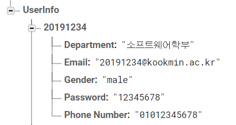
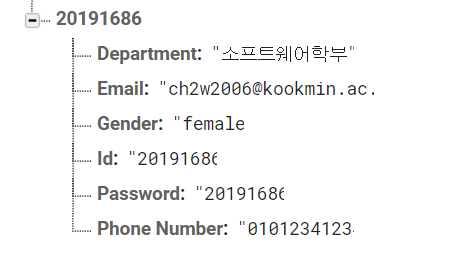

## [모바일 프로그래밍] Project_KookTaxi 
### - 국민대 소프트웨어학부 20191604백연선 / 20191650이한정 / 20191670조나영 / 20191686최혜원
### 20191686 최혜원
#### https://github.com/Hyewon0223/KookTaxi
***
## 실행 화면
<div>
    
    
    
    
    
</div>

- 목적지가 국민대인 사람들을 모아 택시를 함께 탈 수 있도록 하는 앱입니다.
- 출발 지점(길음역, 광화문역, 홍대입구역, 동대문역사문화공원역)과 시간에 따라 사람들을 매칭해준다.
***
## 개발 환경
- Window OS
- Android Studio 4.1.1 (AVD: Pixel 2 API 30 / 안드로이드 폰)
***
## 구현 내용 설명
### 로고 디자인
</img>
### JoinActivity
#### 1) 회원가입시 해당 조건 확인
 - pw와 pwCheck의 일치여부
 - mail이 "@kookmin.ac.kr"로 끝나는가
```
String mailCheck[] = mail.split("@");

else if (!pw.equals(pwCheck)) alarmtext.setText("Please check the password.");
else if (!mailCheck[1].equals("kookmin.ac.kr")) alarmtext.setText("Please check the email.");
```
- mail에서 '@' 기준으로 분리하여 mailCheck를
- mail이 ch2w2006@kookmin.ac.kr일 경우, mailCheck[] = {"ch2w2006","Kookmin.ac.kr"}가 된다    

---   
### MainActivity
#### 1) 각각의 지하철 역으로 연결(MainActivity->SearchActivity)
```
    private String station[] = {"길음역","광화문역","동역사역","홍대입구역"};
    
    public boolean onMarkerClick(Marker marker) {
        for (int i=0;i<station.length;i++) {
            if (marker.getTitle().equals(station[i])) {
                Intent intent = new Intent(MainActivity.this, SearchActivity.class);
                intent.putExtra("mail", mail);
                intent.putExtra("station", station[i]);
                startActivity(intent);
            }
        }
        return true;
    }
```
- 각각의 지하철역의 Searchactivity와 연결하면서 각 정보들을 보냄   
- String배열인 station과 for문을 이용해 코드의 반복을 줄임     
---
### SearchActivity
#### 1) 닉네임 및 역 정보 가져오기
```
Intent intent = getIntent();
mail = intent.getStringExtra("mail");
station = intent.getStringExtra("station");
```
 - 이전 Activity인 MainActivity에서 선택한 지하철 역의 정보와 user정보인 이메일 정보를 가져온다.   
    
#### 2) 다이얼로그에서 채팅방 이름을 적어서 채팅방을 생성   
```
btn_create.setOnClickListener(new View.OnClickListener(){
    @Override
    public void onClick(View view){
        final TimePicker et_inDialog = new TimePicker(SearchActivity.this);
        final AlertDialog.Builder builder = new AlertDialog.Builder(SearchActivity.this);
        builder.setTitle("채팅방 이름 입력");
        builder.setView(et_inDialog);
        builder.setPositiveButton("확인", new DialogInterface.OnClickListener(){
            @Override
            public void onClick(DialogInterface dialogInterface, int i){
                int time_hour = et_inDialog.getCurrentHour();
                int time_minute = et_inDialog.getCurrentMinute();
                str_room = time_hour+"시"+time_minute+"분";

                Map<String, Object> values = toMap(mail, str_room);
                map.put(str_room,"");
                reference.child("ChatInfo").child(station).child(str_room).updateChildren(values);
            }
        });
        builder.setNegativeButton("취소", new DialogInterface.OnClickListener(){
            @Override
            public void onClick(DialogInterface dialogInterface, int i){
                dialogInterface.dismiss();
            }
        });
        builder.show();
     }   
 });
```  
 - 다이얼로그에서 채팅 이름을 적어서 채팅방을 생성   
    : TimePicker를 이용해 다이얼로그 호출   
     + "확인" 버튼을 눌렀을 때    
         : 다이얼로그를 통해 선택한 시간과 분으로 채팅방의 제목 설정   
         : firebase로 메일과 방 제목 정보 전달   
     + "취소" 버튼을 눌렀을 때   
         : 다이얼로그를 종료시킴   
   
#### 3) 특정 경로의 전체 내용에 대한 변경 사항을 읽고 수신 대기함   
```
        btn_create.setOnClickListener(new View.OnClickListener(){
            @Override
            public void onClick(View view){
                final TimePicker et_inDialog = new TimePicker(SearchActivity.this);
                final AlertDialog.Builder builder = new AlertDialog.Builder(SearchActivity.this);
                builder.setTitle("채팅방 이름 입력");
                builder.setView(et_inDialog);
                builder.setPositiveButton("확인", new DialogInterface.OnClickListener(){
                    @Override
                    public void onClick(DialogInterface dialogInterface, int i){
                        int time_hour = et_inDialog.getCurrentHour();
                        int time_minute = et_inDialog.getCurrentMinute();
                        str_room = time_hour+"시"+time_minute+"분";

                        Map<String, Object> values = toMap(mail, str_room);
                        map.put(str_room,"");
                        reference.child("ChatInfo").child(station).child(str_room).updateChildren(values);
                    }
                });
                builder.setNegativeButton("취소", new DialogInterface.OnClickListener(){
                    @Override
                    public void onClick(DialogInterface dialogInterface, int i){
                        dialogInterface.dismiss();
                    }
                });
                builder.show();
            }
        });
```
 - OnDataChange()   
     : database가 변경되었을 때 호출되는 메소드   
     : Iterator를 사용해 database에 있는 정보들을 ListView에 나타냄   
     : 방 목록을 모두 지우고 -> set에 있는 모든 값들을 방 목록에 다시 나타냄   
 - onCancelled()   
     : database가 취소되었을 때 호출되는 메소드      
        
#### 4) 리스트뷰의 채팅방을 클릭했을 때   
```
        listView.setOnItemClickListener(new AdapterView.OnItemClickListener() {
            @Override
            public void onItemClick(AdapterView<?> adapterView, View view, int i, long l) {
                Intent intent = new Intent(getApplicationContext(), ChatActivity.class);
                intent.putExtra("room_name", ((TextView) view).getText().toString());
                intent.putExtra("user_mail",mail);
                intent.putExtra("station", station);
                startActivity(intent);
            }
        });
```
 - 방 제목, 이메일, 지하철 역 정보를 다음 액티비티인 ChatActivity에 전달  
   
 
***
## 코드 작성에 있어 어려움을 겪은 부분
#### 1. [LogInActivity] 이메일로 로그인 후 ID 정보 전달
: 채팅에서 이메일로 사용자의 정보를 나타내니 너무 길어 간략한 ID로 나타내는 것이 더 낫다고 생각하여 로그인을 하고 난 뒤 (LogInActivity -> MainActivity) 다음 액티비티로 정보 전달을 할 때 이메일이 아닌 ID값을 전달하고자 함    
- firebase의 데이터들을 읽어와 해당 이메일 찾고 그 속의 아이디를 찾고자 함      
    : firebase에서 나타나는 각각의 사용자의 대표값이 ID로 보여서 사용자의 이메일을 먼저 찾는 것이 어려웠음   
    </img>
- 대표값을 이메일로 설정하고 그 안의 value들에 ID를 추가하여 위 과정을 시도함    
    : value들에 ID는 추가되었으나, 대표값을 이메일로 설정했음에도 이메일로 바뀌지 않고 학번으로 유지됨    
    </img>
- 로그인을 할 때 처음부터 이메일이 아닌 아이디로 구현하고자 함   
    : firebaseAuth.signInWithEmailAndPassword(mail,pw)를 사용하니 mail을 ID로 바꾸어도 이메일을 입력해야 로그인이 됨     
       
#### 2. [MainActivity] MainActivity에서 SearchActivity로 각각의 지하철마다 연결   
: SearchActivity가 각 지하철마다 4개씩 만들어져야 함   
- xml과 java파일을 4개씩 만들었음 - 코드 작성시 "길음역"만 먼저 구현한 상태에서 다른 지하철 역도 똑같이 하고자 함
 : 그러나 연결되지 않고 에러 발생
- xml과 java를 하나만 해서 같은 파일에 모두 연결
 : Firebase에서 child()를 써서 역마다 다른 정보를 받아올 수 있도록 연결했기 때문에 연결 성공!   
 : 이후, 코드의 무분별한 반복을 줄이기 위해 station이라는 String배열을 만들어서 for문을 이용해 반복함   
    
#### 3. [SearchActivity] Firebase에서 두가지 정보를 분류해 저장
: 사용자의 정보를 저장하는 UserInfo와 채팅방과 채팅 내용의 정보를 저장하는 ChatInfo의 성격이 다르다고 생각해 따로 구분해서 저장하고자 함   
 - 두개의 firebase를 이용하고자 했으나 유료버전이였기 때문에 또 다른 해결 방안을 찾고자 함
``` 
 private DatabaseReference reference = FirebaseDatabase.getInstance().getReference().getRoot();
 Map<String, Object> values = toMap(master_mail, str_room);
 map.put(str_room,"");
 reference.child("ChatInfo").child(station).child(str_room).updateChildren(values);
```
: ChatInfo > 지하철역 > 방 제목 > 방장의 이메일, 방 제목   
: child()와 updateChildren()을 사용해 UserInfo와 ChatInfo는 물론 ChatInfo 안의 여러 지하철역도 분류하여 저장할 수 있게 되었음   
   
#### 4. [ChatActivity]Socket 구현   
: 방장이 "매칭 완료" 버튼을 누르면 모든 사용자(해당 채팅방의 인원들)의 화면에서는 OUT버튼이 사라지게 구현하는 것이 목표   
: btn_out.setVisibility(View.INVISIBLE)을 통해 매칭완료 버튼이 눌리면 사라지게 했지만, 다른 사용자의 화면에서는 사라지지 않음   
- Socket을 이용한다면 방장의 화면에서는 물론, 다른 사용자의 화면에서도 OUT버튼이 사라지지 않을까?   
   
1) ChatActivity에 Socket 코드를 함께 구현   
 > app/src/main/java/com/example/kooktaxi/Socket/ChatActivity.java   
 : socket을 이용해 구현을 했음에도 불구하고 서버에서 받아오는 것이 제대로 되지 않아 방장의 화면에서는 matching 버튼을 누르자 OUT버튼이 사라졌으나, 다른 화면에서는 사라지지 않고 OUT버튼이 계속 존재했음   
   
2) networkclientsocket과 networkseversocket 자바 파일을 따로 만들어 구현   
- [클라이언트]networkclientsocket   
 > app/src/main/java/com/example/kooktaxi/Socket/networkclientsocket.java   
- [서버]networkseversocket   
 > app/src/main/java/com/example/kooktaxi/Socket/networkserversocket.java   
: 위와 같은 두 파일을 추가했더니 ChatActivity와의 연결이 올바르게 되지않아 오류가 계속해서 발생했음   
   
=> Socket은 추후 보완하여 다시 제대로 구현하여야 함      
: ChatActivity에서 정보를 보내 모든 사용자가 화면이 똑같이 변할 수 있도록 하기 위해 개선해야 할 문제 사항   
         
#### 5. [ChatActivity]Out버튼을 눌렀을 때의 채팅방 인원   
> 채팅방에 들어오는 인원을 배열에 추가하고 OUT버튼을 눌러 나가는 인원은 배열에서 삭제하면서 인원 수 세기   
: 들어오는 인원의 수는 올바르게 세어지나 OUT버튼을 눌러 나가는 인원에 대해 수가 제대로 파악되지 않는 현상이 일어남   
1) 배열을 다른 형식으로 바꾸기    
 - [ArrayList]   
 : 들어오는 인원은 값을 제대로 불러오는데 나가는 인원에 대해서는 처음 나간 한 명만 숫자를 세고 그 뒤로는 반응하지 않음   
 : ArrayList를 쓸 때 idx에서 문제가 발생한다고 생각해 순서의 의미가 크게 없는 Set, HashSet, Vector를 사용하기로 함    
- [Set, HashSet, Vector 등]   
 : 순서에 영향이 없는 컬렉션을 사용했지만, 마찬가지로 나가는 인원에 대해서 오류가 발생함   
 : 정확한 원인을 파악하지 못해 추후에 보다 연구하여 개선해야 하는 부분     
2) 인원 수를 세는 방식 변경   
 - user_cnt 사용    
  : 인원이 추가되면 배열에 추가하고 user_cnt++을, 인원이 나가면 배열에서 해당 값을 찾아 user_cnt--을 한다.    
  : 증가되는 것은 정상적으로 되지만, 사람들이 나갈때 1명까지는 정상적으로 계산되지만 그 이후로는 계산되지 않는다.   
  - size() 사용     
  : Vector, Set, HashSet 컬렉션을 사용할 때 user_cnt++을 사용하기 보다 사람들이 들어오고 나가는 과정에서 각 배열에 add와 remove를 하므로 size()를 이용해 인원 수를 세도록 하였다.   
  : 의도한대로 +1씩 더해지는 것이 아닌 +3,+4씩 더해졌다.   
  - total_cnt 사용   
   : ArrayList, Vector, Set, HashSet 컬렉션을 사용할 때 들어오는 사람의 수를 user_in_cnt++로, 나가는 사람의 수를 user_out_cnt++로 계산하여 total_cnt = user_int_cnt - user_out_cnt로 계산한다.      
   : 증가되는 것은 정상적으로 되지만, 사람들이 나갈때 1명까지는 정상적으로 계산되지만 그 이후로는 계산되지 않는다.   
   
  
